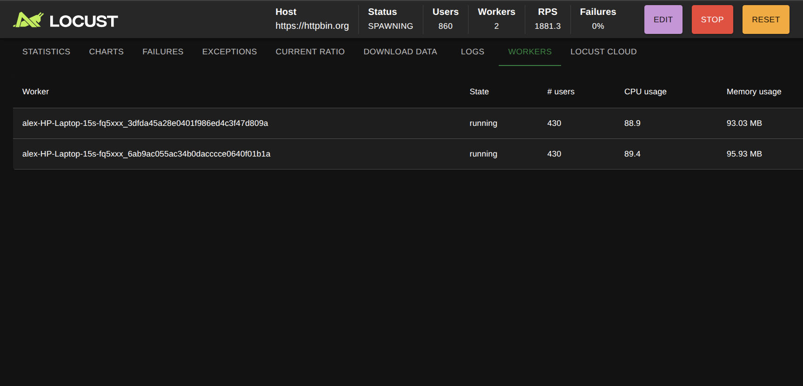
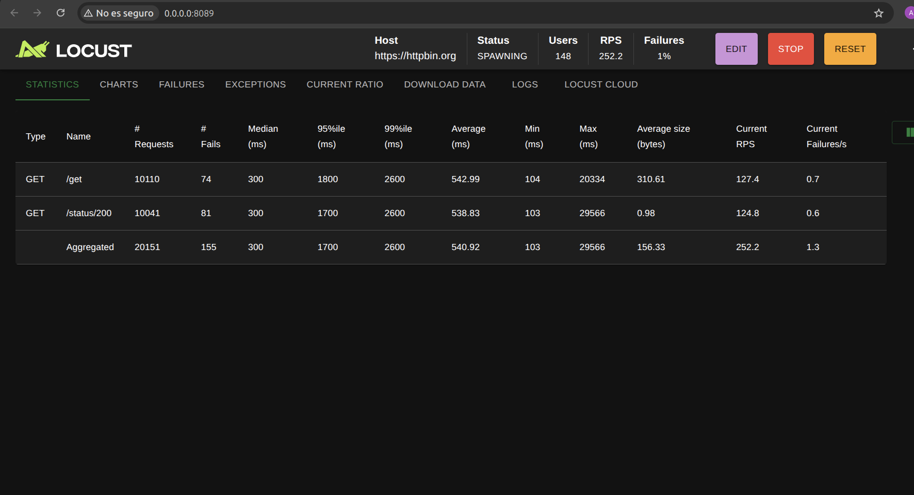
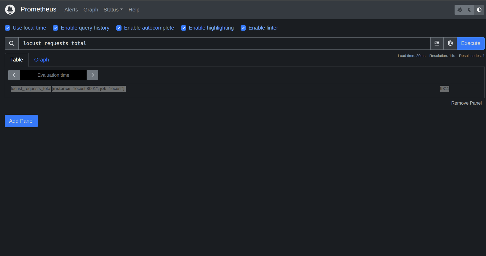
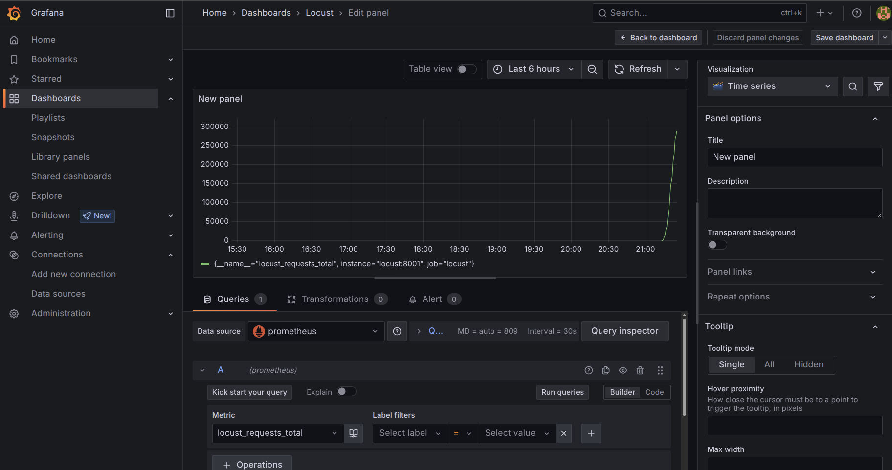

<div align="center">

# 🚀 Locust Load Testing Project


</div>

## 📋 Overview

This project uses [Locust](https://locust.io/) to perform automated load testing on an API or web application.

---

## 📦 Requirements

- Python 3.8+
- Virtual environment (recommended)
- Locust (`pip install locust`)
- Browser to view HTML reports
- Linux or WSL recommended for better performance
- Docker and docker-compose (if using Docker setup)
---

## 🚀 How to Run the Tests


### 1. Run in **browser** mode (with web UI)

```bash
locust -f tests/locustfile.py 

```
### 2. Run in **headless** mode (without web UI)

```bash
locust -f tests/locustfile.py --headless -u 50 -r 10 --host=https://httpbin.org -t 2m
```
### 3. Run in **headless** mode (no browser, ideal for CI/CD including reports directory and its files)

```bash
bash ./run_load_test.sh

```
---

## 🎯 How to run distributed tests on a single machine

If you want to simulate a distributed Locust environment on a single computer, you can start a master and multiple workers in separate terminals.

### Start the master (machine or terminal 1) and the slaves (machine or terminal 2 and 3)

```bash
locust -f tests/locustfile.py --master

locust -f tests/locustfile.py --worker --master-host=127.0.0.1

```
Open the master’s web interface at http://localhost:8089





## 🔥 How to Build and run Docker container
 This Dockerfile is configured to run Locust in headless mode.

```bash
docker build -t locust-load-testing .
docker run -p 8089:8089 -p 8000:8000 locust-load-testing
```

## 🐳 Using Docker Compose (Recommended for full stack with Prometheus & Grafana)

```bash
docker compose up --build

```
## 🖥️ Accessing the Services 
### Locust - Prometheus - Grafana Integration Overview

## Overview

This setup integrates Locust load testing with Prometheus monitoring and Grafana visualization.

- **Locust** runs load tests and exposes Prometheus metrics at:  
  `http://<locust-host>:8001/metrics`

- **Prometheus** scrapes these metrics from Locust at regular intervals and stores them.  
  Access Prometheus UI and API at:  
  `http://<prometheus-host>:9090`

- **Grafana** connects to Prometheus as a data source to create dashboards with PromQL queries.  
  Access Grafana UI at:  
  `http://<grafana-host>:3000`

## Workflow

1. Locust generates and exposes metrics.
2. Prometheus scrapes and stores these metrics.
3. Grafana queries Prometheus to visualize the data in dashboards.

## Key Endpoints

- Locust metrics endpoint: `/metrics` on port `8001`  
- Prometheus UI: port `9090`  
- Grafana UI: port `3000`

---




